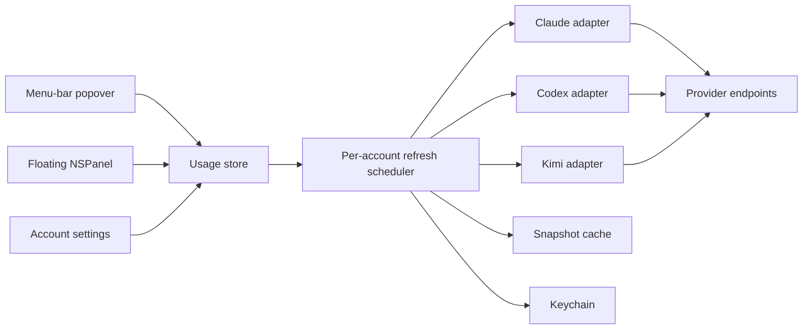

# Agentic Usage Meter Design

**Date:** 2026-07-29
**Status:** Approved; Claude web-session amendment pending written review
**Target:** macOS 26, Swift 6, SwiftUI
**Distribution:** Direct download, Developer ID signed, hardened, and notarized

## Summary

Agentic Usage Meter is a macOS menu-bar application for comparing subscription
quota across multiple Claude Code, Codex, and Kimi Code accounts. It displays
the providers' short and weekly quota windows on shared time axes, including
remaining capacity and reset times. An optional floating widget presents the
same information without opening the menu-bar popover.

The app communicates directly with each provider. It has no relay service,
cloud sync, analytics, or telemetry. OAuth credentials are kept in Keychain,
Claude web sessions are kept in isolated WebKit data stores, and non-secret
normalized snapshots are cached locally.

The provider usage interfaces are not stable public APIs. Provider
qualification against real accounts is therefore a prerequisite to building
the full product, not a step that can be replaced by mocked tests.

## Goals

- Display five-hour and weekly subscription limits for multiple accounts at
  once.
- Display when every active limit window resets.
- Make quota consumption pace visually comparable with elapsed calendar time.
- Support multiple independently authenticated accounts from the same
  provider, including separate work and personal Codex accounts.
- Support Claude Code, Codex, and Kimi Code in v1.
- Use isolated embedded web sessions for Claude and regular browser
  authentication for Codex and Kimi.
- Keep provider requests infrequent and deterministic.
- Remain useful through transient network and provider failures.

## Non-goals

V1 will not include:

- Historical usage storage or trend charts
- Forecasting
- Notifications
- Provider billing or spending APIs
- iOS support
- Cloud synchronization
- Telemetry or analytics
- Automatic credential discovery from other applications
- Importing Claude credentials from Claude Code configuration
- Compatibility with macOS releases before macOS 26

## Architecture

The product is one native application process. It does not embed or depend on
the Codex app-server and does not install a daemon or helper.

The SwiftUI app lifecycle owns a shared observable usage store. A
`MenuBarExtra`, account-management window, and optional floating `NSPanel`
consume that store. The floating panel is an AppKit presentation shell around
the same SwiftUI timeline components used by the popover; it is not a separate
data path.

Provider-specific components own authentication, decoding, and token refresh.
Claude's WebKit session manager is main-actor isolated; the remaining provider
adapters are actors. Provider response types stop at the adapter boundary. The
rest of the app sees only normalized accounts, windows, snapshots, and errors.

## Domain Model

The central model has these concepts:

### Subscription account

- Stable local identifier
- Provider
- User-assigned display name
- Authenticated identity when the provider exposes one
- User-defined display order
- Keychain credential reference
- Connection state

Two accounts with the same provider are always independent. They have separate
credentials, refresh scheduling, cached snapshots, and error states.

### Usage window

- Window kind, such as short or weekly
- Provider-reported duration
- Absolute reset time
- Derived start time: `reset time - duration`
- Remaining fraction
- Consumed fraction: `1 - remaining fraction`

The model retains absolute dates and provider-reported durations. Relative
phrases such as "in 2h 14m" are derived at render time.

### Usage snapshot

- Account identifier
- Collection time
- Normalized windows
- Provider response version or shape marker where useful for diagnostics

The cache stores the last successful normalized snapshot, not bearer tokens or
raw provider responses.

### Presentation state

Each account is in one of these states:

- Current
- Stale with a last successful snapshot
- Temporarily unavailable with a last successful snapshot
- Reauthentication required
- Unsupported response
- Waiting for its first successful snapshot

One account's state never prevents another account from rendering or
refreshing.

## Information Design

Accounts are shown in stable provider stacks: Claude, Codex, and Kimi.
Accounts inside each provider use the user's display order. Rows do not reorder
themselves based on quota.

Weekly windows share a 14-day time axis centered on now. Every active
seven-day window fits on that axis. Five-hour windows likewise share a ten-hour
axis centered on now. If a provider reports a different duration, the adapter
preserves that duration and the UI labels it honestly rather than forcing it
into the five-hour or weekly group.

Each account row is a bars-inside-Gantt visualization:

- The outer Gantt bar starts at the derived window start and ends at reset.
- A colored inner bar begins at the window start, fills from left to right as
  quota is consumed, and occupies the outer bar's full height.
- The inner fill's leading edge can be compared with the shared now line.
  Ahead of now means quota is being consumed faster than calendar time; behind
  now means the current pace has headroom.
- The unfilled portion represents quota remaining.
- A left overlay pill displays the exact percentage remaining.
- A right overlay pill displays the window expiry.
- Dark translucent pill backgrounds remain readable over filled and unfilled
  regions.
- Provider identity is encoded separately from quota health so provider color
  does not imply danger.

The menu-bar label shows the lowest remaining percentage across all windows
and accounts. A tie is resolved by the earliest reset time. The popover and
floating widget retain stable account ordering even though the menu-bar label
surfaces the tightest limit.

The optional floating widget uses the same provider stacks and time model at a
larger persistent size. Closing it does not stop background refreshes while the
menu-bar app remains running.

## Account Connection

### Claude

The app opens a visible embedded Claude login window. Each connection attempt
uses a new persistent `WKWebsiteDataStore` identified by a random UUID. The
login window and that account's usage fetcher use only that data store, so
work, personal, and other Claude sessions remain independent.

After the user completes login, the app uses the same WebKit profile to fetch
the authenticated identity and subscription-usage response. The account is
saved only after both requests succeed. Cancelling or failing a new connection
releases its web views and deletes the provisional data store.

The account record retains the non-secret WebKit data-store identifier. Session
cookies and other browser state remain inside WebKit; they are never copied
into application settings, Keychain, logs, fixtures, or diagnostics. Removing
or reconnecting an account first releases every web view using its data store
and then removes the complete identified store.

Scheduled refreshes use a minimal WebKit-backed request with the account's
profile rather than loading the full Claude application UI. The Claude
qualification spike must identify the current web usage and identity endpoints,
prove that the request works from two isolated stores, and capture only a
sanitized response fixture.

`claude setup-token` is not used. Live qualification showed that it grants
inference scope but cannot call the profile-scoped usage endpoint. Claude Code
status-line data is also not authoritative because it updates only after the
corresponding Claude Code session makes an inference request.

### Codex

The app implements the same native PKCE OAuth protocol used by Codex, opens
authentication in the user's regular browser, and receives the redirect
through a temporary localhost callback listener. The listener exists only for
the active authorization attempt; it is not an application server.

The authenticated identity and account identifier are recorded with the
credential. Usage is fetched directly from the ChatGPT usage interface.
Adding another Codex account repeats the entire flow and creates a separate
Keychain item and refresh-token lineage.

The UI must make account identity visible before saving so an existing browser
session does not silently connect the wrong work or personal account.

### Kimi

The app requests a device authorization, opens the verification URL in the
regular browser, displays the user code and expiry, and polls only the device
authorization token endpoint at the provider-specified interval. Once
authorized, it validates the credential against Kimi's coding usage endpoint
before saving.

## Refresh Scheduling

Ten minutes is a hard minimum between usage requests for an individual
account, including user-initiated refresh.

Every account scheduler records:

- Last usage request start
- Last successful response
- Earliest next eligible request
- Current in-flight task
- Provider-directed retry time
- Failure backoff

The next eligible request cannot occur before ten minutes after the previous
request began. A provider `Retry-After` value or failure backoff may extend that
time but never shorten it.

All demand for the same account is coalesced. Opening the popover, showing the
widget, a scheduled refresh, and a manual refresh cannot create duplicate
requests. Manual refresh during the floor displays the remaining wait instead
of bypassing it.

At launch, the app renders cached snapshots immediately. It fetches only
accounts whose last request is at least ten minutes old. Wake-from-sleep uses
the same eligibility check rather than attempting to catch up on missed
intervals.

Transient failures use exponential backoff capped at one hour unless the
provider supplies a later retry time. Authentication failures stop polling the
affected account until the user reconnects it. Credential refresh occurs only
when required by credential expiry or authentication response; it is not a
second polling loop.

An injected clock makes scheduling and coalescing behavior testable without
real waits.

## Persistence and Security

Keychain stores all Codex and Kimi bearer tokens, refresh tokens, and
device-flow credentials. Each account has a separate Keychain item. Rotated
refresh credentials replace the previous value atomically.

Every Claude account has a separate persistent WebKit data store. WebKit owns
its cookies, local storage, caches, and related browser state. The app stores
only the data-store UUID and sanitized account identity outside that store.

Application Support stores:

- Non-secret account metadata
- Account ordering and labels
- Floating-widget preference and placement
- Last successful normalized snapshots
- Refresh timestamps and non-secret backoff state

Cache writes are atomic. Removing an account deletes its local data and its
Keychain item, if any. Removing a Claude account also releases its web views
and deletes its identified WebKit data store.

Logs must never include authorization headers, token values, callback query
parameters, pasted secure-field contents, or complete raw provider responses.
Sanitized diagnostic errors may include provider, HTTP status, response-shape
identifier, and account's local identifier.

All provider traffic originates from the Mac and goes directly to the
provider. The app has no remote service. Release builds use the hardened
runtime, Developer ID signing, and notarization.

## Error Behavior

A temporary error does not erase valid data. The last successful snapshot
stays visible with its age and a subdued error indicator. When no successful
snapshot exists, the row shows a provider-specific unavailable state instead
of zero quota.

Authentication errors show a reconnect action and stop automatic requests for
that account. Unsupported response shapes show that the provider integration
needs an update. They are not decoded as empty windows or zero remaining
capacity.

Reset times are rendered in the user's current time zone. Device clock changes
and time-zone changes recompute presentation geometry from absolute dates.

## Provider Qualification Gates

These three spikes precede the full application implementation:

1. **Claude:** Prove that two persistent WebKit data stores can remain signed
   into different Claude accounts simultaneously, retrieve the correct
   identity for each store, and return both required usage window types without
   loading the full Claude application during refresh.
2. **Codex:** Prove native PKCE login from the app, direct usage retrieval, token
   refresh, and two independently authenticated accounts.
3. **Kimi:** Prove device authorization, token refresh where applicable, and
   direct usage retrieval with both required windows.

Each spike must capture a sanitized response fixture, document expiry and
refresh behavior, and avoid committing credentials or personal account data.

Failure of a gate stops implementation of that provider. The connection design
must be revised explicitly; the app will not conceal a CLI subprocess,
credential scraping, or browser-extension workaround behind the adapter.

## Testing

Automated tests cover real domain contracts rather than rendered strings:

- Decode sanitized, observed provider fixtures into normalized snapshots.
- Reject missing required window fields without fabricating values.
- Derive window starts and consumed fractions.
- Calculate shared timeline geometry and now-line placement.
- Choose the menu-bar's tightest limit deterministically.
- Enforce the ten-minute per-account floor.
- Coalesce simultaneous demand into one request.
- Honor longer provider retry times and failure backoff.
- Preserve last-good data through transient failures.
- Stop polling and transition to reconnect on authentication failure.
- Persist and reload normalized snapshots.
- Exercise credential storage through a Keychain abstraction with an in-memory
  test implementation.
- Exercise Claude profile creation, isolation, provisional cleanup, reconnect,
  and deletion through a WebKit session-store abstraction.

Focused SwiftUI tests verify that normalized presentation states expose the
correct accessibility values and actions. They do not assert large rendered
view strings.

Provider qualification uses explicitly initiated real-account checks. Passing
fixtures and mocks does not count as proof that a provider currently accepts
the authentication flow.

Release acceptance requires:

- All automated tests
- The three real-provider qualification gates
- A live menu-bar and floating-widget interaction pass
- A signed and notarized application launched from the distributed artifact

## Research Basis

The design was informed by current provider implementations and documentation
inspected on 2026-07-29:

- [OpenAI Codex app-server account and rate-limit interfaces](https://github.com/openai/codex/blob/main/codex-rs/app-server/README.md)
- [OpenAI Codex native login implementation](https://github.com/openai/codex/blob/main/codex-rs/login/src/server.rs)
- [Claude Code authentication documentation](https://code.claude.com/docs/en/authentication)
- [Claude Code error reference](https://code.claude.com/docs/en/errors)
- [Claude Code CLI reference](https://code.claude.com/docs/en/cli-reference)
- [WebKit website data stores](https://developer.apple.com/documentation/webkit/wkwebsitedatastore)
- [Kimi Code membership and usage documentation](https://www.kimi.com/code/docs/en/kimi-code/membership.html)

These references establish feasibility, not a compatibility promise. The
qualification gates remain authoritative because the relevant subscription
usage interfaces may change without notice.
